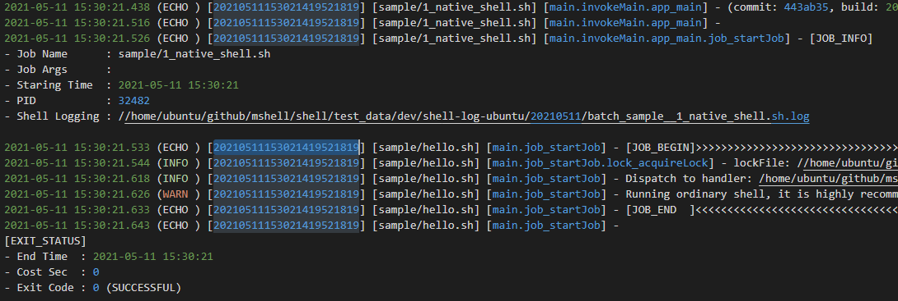

# SimpleLog4sh
日志文件截图：


# 简介
**simpleLog4sh**是一个极为简单的shell日志框架，甚至不应该叫日志框架。  它足够简单，却十分实用：**区区几百行的纯shell脚本，没有任何依赖**。

**simpleLog4sh**不期望做到像Apache日志框架一样复杂，但可以显著提升你的shell脚本日志体验，让你从繁琐的echo中解脱。

通过简单的封装，这个小shell可以完成如下功能：  
1. logInfo，logDebug, logWarn, logError等多级别日志输出，并可控制输出日志的级别  
2. 日志文件按日期进行归档，并自动清理   
3. 日志记录带有时间戳、日志级别、函数调用链  
4. 接管stdout/stederr，第三方命令的输出可复制或重定向到日志文件  
5. throw语法抛出异常  


上手简单，符合习惯：

```
logInfo hello, world
logDebug "hello, world" # 推荐将所有的内容用双引号包围
```

输出内容举例如下：

```
2015-08-26 20:12:21 [test.sh] (INFO) hello, world
2015-08-26 20:12:21 [test.sh] (DEBUG) hello, world
```


# 使用方法举例
## 导入simpleLog4sh
在您的shell开头导入即可，可以参考`/example/quickstart`的中的用法：

```
. ../src/simplelog4sh.sh
```

如果需要覆盖默认配置，可提供配置文件（参考源码中提供的cfg文件）
```
. ../src/simpleLog4sh.source ../src/simpleLog4sh.cfg
```

## `logXXX`语句
simpleLog4sh提供了四个日志级别的方法，他们分别是  
1. `logDebug`  
2. `logInfo`  
3. `logWarn`   
4. `logError`

用法很简单，所有的参数都会被当做日志内容记录，比如：

```
logInfo hello, world
logDebug "hello, world" # 推荐将所有的内容用双引号包围
```

输出内容举例如下（默认输出到`/tmp/simpleLog4sh`目录）：

```
2015-08-26 20:03:18 [test.sh] (INFO) hello, this logInfo
2015-08-26 20:12:21 [test.sh] (DEBUG) hello, logDebug
2015-08-26 20:12:21 [test.sh] (INFO) hello, logInfo
2015-08-26 20:12:21 [test.sh] (WARN) hello, logWarn
2015-08-26 20:12:21 [test.sh] (ERROR) hello, logError
2015-08-26 20:12:21 [test.sh] (ECHO) hello, myEcho
2015-08-26 20:12:21 [test.sh] (ECHO_ERROR) hello, myEchoError
2015-08-26 20:13:26 [test.sh] (DEBUG) hello, logDebug
```

## 设置日志级别
simpleLog4sh支持6个日志级别，含义与Apache日志框架类似：  
1. `ALL`  
2. `DEBUG`  
3. `INFO`  
4. `WARN`  
5. `ERROR`  
6. `OFF`

如果要设置指定的日志级别，请在导入simpleLogsh之后加载配置文件，并在配置文件内设置`simpleLog4sh_LOG_LEVEL`变量，取值如下：

```
ALL  
DEBUG  
INFO  
WARN  
ERROR  
OFF  
```

## `throw`语句
`throw`语句类似java语言中抛异常。通过使用`throw`语句，达到类似抛异常的效果。比如：

```
throw "ParamsNumberException: need 2 params"
```
使用throw语句，程序将在stderr输出上述语句，同时在日志文件以LOG_LEVEL_ERROR级别记录。最后程序会意退出码1退出。

## `logEcho`与`logEchoError`语句
`logEcho`和`logEchoError`与shell的`echo`语句类似，但有两点增强：  
1. `logEcho`和`logEchoError`不仅会输出到控制台，还会输出到日志文件。  
2. `logEchoError`的输出是stdErr

## 日志路径与日志文件滚动
默认程序的输出日志路径是`/tmp/simplelog4sh`，并在此目录下面生成已当前日期命名的日志文件，类似如下：

```
-rw-r--r--  1 maoshuai  wheel  1839  8 25 23:48 log_20150825.log
-rw-r--r--  1 maoshuai  wheel  1839  8 26 20:32 log_20150826.log
```
当然，你可以通过加载配置文件，修改`simpleLog4sh_LOG_DIR`变量的值，实现自定义日志目录。