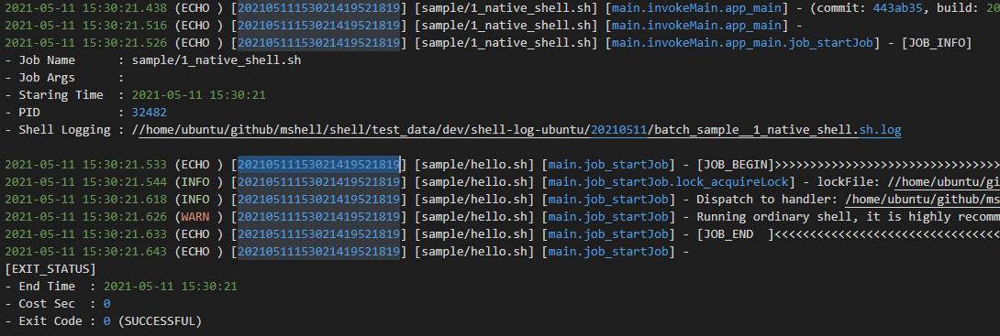

# SimpleLog4sh



**SimpleLog4sh** is an extremely simple shell logging framework – so simple that it shouldn't even be called a logging framework. It's lightweight yet highly practical: **just a few hundred lines of pure shell script with no dependencies**.

SimpleLog4sh doesn't aim to be as complex as Apache Log4j, but it can significantly enhance your shell script logging experience and free you from tedious `echo` statements.

Through simple encapsulation, this small shell script provides the following features:

1. **Multi-level logging**: `logInfo`, `logDebug`, `logWarn`, `logError` with configurable log levels
2. **Automatic log rotation**: Daily log archiving with automatic cleanup
3. **Rich log format**: Timestamps, log levels, and function call chains
4. **Stdout/stderr redirection**: Third-party command output can be duplicated or redirected to log files
5. **Exception handling**: `throw` syntax for exception-like behavior

## Quick Start

Easy to use and follows familiar patterns:

```bash
logInfo "hello, world"
logDebug "hello, world"  # Recommended to wrap all content in double quotes
```

Example output:
```
2015-08-26 20:12:21 [test.sh] (INFO) hello, world
2015-08-26 20:12:21 [test.sh] (DEBUG) hello, world
```

## Usage Examples

### Importing SimpleLog4sh
Simply source the script at the beginning of your shell script. Refer to `/examples/quickstart` for usage:

```bash
. ../src/simpleLog4sh.source
```

To override default configuration, provide a configuration file (refer to the cfg file in the source code):
```bash
. ../src/simpleLog4sh.source ../src/simpleLog4sh.cfg
```

### `logXXX` Statements
SimpleLog4sh provides four logging level methods:
1. `logDebug`
2. `logInfo` 
3. `logWarn`
4. `logError`

Usage is straightforward – all parameters are treated as log content:
```bash
logInfo "hello, world"
logDebug "hello, world"  # Recommended to wrap all content in double quotes
```

Example output (default output to `/tmp/simpleLog4sh` directory):
```
2015-08-26 20:03:18 [test.sh] (INFO) hello, this logInfo
2015-08-26 20:12:21 [test.sh] (DEBUG) hello, logDebug
2015-08-26 20:12:21 [test.sh] (INFO) hello, logInfo
2015-08-26 20:12:21 [test.sh] (WARN) hello, logWarn
2015-08-26 20:12:21 [test.sh] (ERROR) hello, logError
2015-08-26 20:12:21 [test.sh] (ECHO) hello, myEcho
2015-08-26 20:12:21 [test.sh] (ECHO_ERROR) hello, myEchoError
2015-08-26 20:13:26 [test.sh] (DEBUG) hello, logDebug
```

### Setting Log Levels
SimpleLog4sh supports 6 log levels, similar to Apache logging framework:
1. `ALL`
2. `DEBUG`
3. `INFO`
4. `WARN`
5. `ERROR`
6. `OFF`

To set a specific log level, load a configuration file after importing SimpleLog4sh and set the `simpleLog4sh_LOG_LEVEL` variable in the config file with one of the above values.

### `throw` Statement
The `throw` statement works similarly to Java's exception throwing. Using `throw` achieves exception-like behavior:

```bash
throw "ParamsNumberException: need 2 params"
```

Using `throw` will output the message to stderr, log it as `LOG_LEVEL_ERROR` in the log file, and exit the program with exit code 1.

### `logEcho` and `logEchoError` Statements
`logEcho` and `logEchoError` are similar to shell's `echo` statement but with two enhancements:
1. They output to both console and log file
2. `logEchoError` outputs to stderr

### Log Path and Log File Rotation
By default, log files are output to `/tmp/simplelog4sh` directory, with daily log files named by date:

```
-rw-r--r--  1 maoshuai  wheel  1839  8 25 23:48 log_20150825.log
-rw-r--r--  1 maoshuai  wheel  1839  8 26 20:32 log_20150826.log
```

You can customize the log directory by loading a configuration file and modifying the `simpleLog4sh_LOG_DIR` variable.

## License

Distributed under the Apache License 2.0. See [LICENSE](LICENSE) for more information.

## Author

**Maoshuai** – [GitHub](https://github.com/maoshuai) – imshuai67@gmail.com

---

[🇨🇳 中文版 README](README.md)